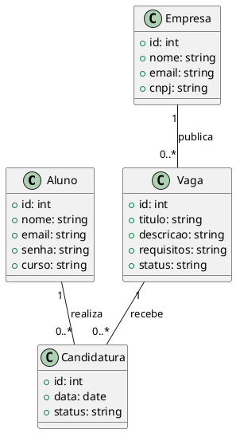

# Documento de Arquitetura de Software (DAS)

# Sistema de Gestão de Estágios

**Autores:**  
- Rafael Barbosa  
- Jorge do Cruzeiro  
- Davi Ito  
- Gabriel Lima  
- Gabriel Aguiar  

**Disciplina:** Projeto Back-End  
**Semestre:** 2026.1  
**Instituição:** Ibmec  

---

## Introdução

### Proposta

Este documento apresenta uma visão geral da arquitetura do sistema de gestão de estágios, utilizando diferentes visões arquiteturais para destacar os principais aspectos da aplicação. Ele tem como objetivo registrar as decisões arquiteturais adotadas durante o desenvolvimento do sistema.

---

### Escopo

A aplicação "Sistema de Gestão de Estágios" tem como objetivo centralizar e organizar o processo de estágios da instituição, permitindo o cadastro de alunos, empresas e vagas, além do acompanhamento das candidaturas.

---

### Definições, Acrônimos e Abreviações

- MVC – Model View Controller  
- API – Application Programming Interface  
- SGE – Sistema de Gestão de Estágios  

---

## Visão Geral

O Documento de Arquitetura de Software (DAS) apresenta uma visão geral da arquitetura do sistema, abordando diferentes aspectos da aplicação.

Neste documento são tratadas as seguintes visões:

- Caso de Uso  
- Lógica  
- Implantação  
- Implementação  
- Dados  

---

## Representação Arquitetural

### Cliente-Servidor

A aplicação segue o modelo cliente-servidor, onde o frontend é responsável pela interação com o usuário e o backend pelo processamento das regras de negócio e acesso aos dados.

#### Cliente (Frontend)

- **View**: responsável pela interface e exibição das informações ao usuário  

#### Servidor (Backend)

- **Controller**: responsável por receber requisições e encaminhar para as camadas adequadas  
- **Service**: responsável pela lógica de negócio do sistema  
- **Model**: responsável pela manipulação e organização dos dados  

---

## Objetivos de Arquitetura e Restrições

### Objetivos

- **Segurança**: garantir autenticação e proteção dos dados dos usuários  
- **Privacidade**: assegurar o tratamento adequado das informações  
- **Desempenho**: responder às requisições de forma eficiente  
- **Reusabilidade**: permitir reaproveitamento de componentes  
- **Escalabilidade**: suportar múltiplos usuários simultaneamente  

---

### Restrições

- **Acesso à internet**: o sistema depende de conexão ativa  
- **Plataforma**: acesso via navegador web  
- **Compatibilidade**: funcionamento em navegadores modernos (Chrome, Edge e Firefox)  
- **Banco de Dados**: será definido nas próximas etapas do projeto  

---

## Ferramentas Utilizadas

- **Python**: linguagem utilizada no backend  
- **HTML, CSS e JavaScript**: construção da interface  
- **MkDocs**: documentação do projeto  
- **Git e GitHub**: controle de versão  
- **PlantUML**: criação de diagramas  

---

## Visão de Caso de Uso

Os principais casos de uso do sistema envolvem a interação entre alunos, empresas e a instituição.

- Cadastro de usuário  
- Cadastro de vagas  
- Visualização de vagas  
- Candidatura a vagas  
- Seleção de candidatos  
- Acompanhamento de candidatura  

---

## Visão Lógica

O sistema é estruturado em camadas, separando responsabilidades entre interface, lógica de negócio e manipulação de dados.

Essa divisão facilita a manutenção e evolução do sistema.

---

## Visão de Implantação

A aplicação será disponibilizada em ambiente web, podendo ser acessada por meio de navegadores.

O sistema será executado em servidor, com acesso remoto pelos usuários.

---

## Visão de Implementação

### Visão Geral

O sistema será implementado utilizando arquitetura baseada em camadas, com separação entre:

- Controllers  
- Services  
- Models  

Essa organização permite maior clareza, organização e manutenção do código.

---

## Visão de Dados

### Modelo Entidade Relacionamento (MER)

As principais entidades do sistema são:

- Aluno  
- Empresa  
- Vaga  
- Candidatura  

---

### Entidades e Relacionamentos

- Um aluno pode se candidatar a várias vagas  
- Uma vaga pode possuir vários candidatos  
- Uma empresa pode publicar várias vagas  

---

### Diagrama Entidade Relacionamento (DER)

O DER representa graficamente as entidades e seus relacionamentos, servindo como base para a construção do banco de dados.

---

## Tamanho e Desempenho

O sistema foi projetado para suportar múltiplos usuários simultaneamente, mantendo um tempo de resposta adequado para as operações principais.

---

## Qualidade

O sistema busca atender critérios de qualidade como:

- Usabilidade  
- Segurança  
- Desempenho  
- Confiabilidade  

---

## Referências Bibliográficas

- Engenharia de Software Moderna  
- Documentações oficiais das tecnologias utilizadas  

---

---
## Diagrama de Classes — Visão de Dados (SGE)

---

## Histórico de Versão

| Data       | Versão | Descrição             | Autor(es)                                                                 |
|------------|--------|-----------------------|---------------------------------------------------------------------------|
| 16/04/2026 | 1.0    | Criação do documento  | Rafael Barbosa, Jorge do Cruzeiro, Davi Ito, Gabriel Lima e Gabriel Aguiar |