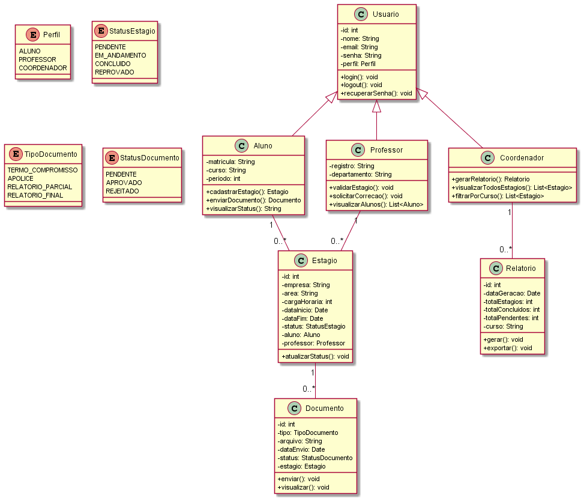

## Introdução

O Diagrama de Classes é um dos principais artefatos da UML (Unified Modeling Language) e tem como objetivo representar a estrutura estática do sistema, descrevendo as classes que o compõem, seus atributos, métodos e os relacionamentos entre elas. No contexto deste projeto, o diagrama foi utilizado para modelar as entidades do Sistema de Gestão de Estágios Acadêmicos do IBMEC, servindo como referência para o desenvolvimento e para a compreensão da arquitetura do sistema.

## Metodologia

A equipe analisou os requisitos levantados nas etapas anteriores — 5W2H, Brainstorming e Casos de Uso — para identificar as principais entidades do sistema e seus relacionamentos. O diagrama foi elaborado utilizando a ferramenta draw.io e segue a notação padrão UML. As classes foram organizadas de acordo com os três perfis de usuário do sistema: Aluno, Professor Orientador e Coordenador.

## Diagrama de Classes

### Versão 1.0

A primeira versão do diagrama contempla as classes centrais do sistema: Usuario, Aluno, Professor, Coordenador, Estagio, Documento e Relatorio. Os relacionamentos modelam o ciclo completo de um estágio, desde o cadastro pelo aluno até a validação pelo professor e geração de relatórios pela coordenação.

#### Descrição das Classes

**Usuario**
- id: int
- nome: String
- email: String
- senha: String
- perfil: Enum (ALUNO, PROFESSOR, COORDENADOR)
- + login(): void
- + logout(): void
- + recuperarSenha(): void

**Aluno** (herda de Usuario)
- matricula: String
- curso: String
- periodo: int
- + cadastrarEstagio(): Estagio
- + enviarDocumento(): Documento
- + visualizarStatus(): String

**Professor** (herda de Usuario)
- registro: String
- departamento: String
- + validarEstagio(): void
- + solicitarCorrecao(): void
- + visualizarAlunos(): List\<Aluno\>

**Coordenador** (herda de Usuario)
- + gerarRelatorio(): Relatorio
- + visualizarTodosEstagios(): List\<Estagio\>
- + filtrarPorCurso(): List\<Estagio\>

**Estagio**
- id: int
- empresa: String
- area: String
- cargaHoraria: int
- dataInicio: Date
- dataFim: Date
- status: Enum (PENDENTE, EM_ANDAMENTO, CONCLUIDO, REPROVADO)
- aluno: Aluno
- professor: Professor
- + atualizarStatus(): void

**Documento**
- id: int
- tipo: Enum (TERMO_COMPROMISSO, APOLICE, RELATORIO_PARCIAL, RELATORIO_FINAL)
- arquivo: String
- dataEnvio: Date
- status: Enum (PENDENTE, APROVADO, REJEITADO)
- estagio: Estagio
- + enviar(): void
- + visualizar(): void

**Relatorio**
- id: int
- dataGeracao: Date
- totalEstagios: int
- totalConcluidos: int
- totalPendentes: int
- curso: String
- + gerar(): void
- + exportar(): void

## Conclusão

A elaboração do Diagrama de Classes permitiu à equipe ter uma visão clara e estruturada das entidades do sistema e de como elas se relacionam entre si. O artefato foi essencial para guiar as decisões de desenvolvimento, facilitando a definição das tabelas do banco de dados e a implementação das funcionalidades. A modelagem orientada a objetos evidenciou a hierarquia de usuários e o fluxo de responsabilidades entre aluno, professor e coordenador no ciclo de gestão dos estágios.

## Referências

> BOOCH, G.; RUMBAUGH, J.; JACOBSON, I. UML: Guia do Usuário. 2. ed. Rio de Janeiro: Elsevier, 2006.

> LARMAN, C. Utilizando UML e Padrões. 3. ed. Porto Alegre: Bookman, 2007.

> Ferramenta draw.io. Disponível em: https://www.drawio.com

> PMI. Um guia do conhecimento em gerenciamento de projetos. Guia PMBOK® 5a. ed. EUA: Project Management Institute, 2013.

## Autor(es)

| Data     | Versão | Descrição                              | Autor(es)       |
| -------- | ------- | ---------------------------------------- | --------------- |
| 16/04/25 | 1.0     | Criação do documento                   | [Davi, Rafael, Jorge Alves, Gabriel, Gabriel] |
| 16/04/25 | 1.1     | Adicionado diagrama e descrição das classes | [Davi, Rafael, Jorge Alves, Gabriel, Gabriel] |
| 16/04/25 | 1.2     | Adicionadas conclusão e referências    | [Davi, Rafael, Jorge Alves, Gabriel, Gabriel] |
