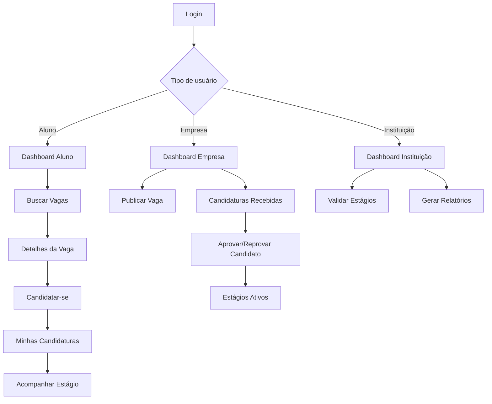

# Protótipo de Alta Fidelidade

## Introdução

Este documento descreve o Protótipo de Alta Fidelidade do Sistema de Gestão de Estágios. O protótipo foi desenvolvido com o objetivo de validar a interface e os fluxos de navegação antes da implementação.

> **Acesso ao protótipo interativo:** [Visualizar no Figma](https://www.figma.com) *(substituir pelo link real do Figma quando disponível)*

---

## Telas do Sistema

### 1. Tela de Login

A tela de login é o ponto de entrada do sistema. O usuário informa seu e-mail e senha para autenticação. Há opção de seleção de perfil (Aluno, Empresa ou Instituição) para redirecionamento correto após o login.

**Elementos principais:**
- Campo de e-mail
- Campo de senha
- Botão "Entrar"
- Link "Esqueci minha senha"
- Link "Criar conta"

---

### 2. Tela de Cadastro — Aluno

Formulário de registro para novos alunos. Coleta informações acadêmicas e pessoais necessárias para o uso do sistema.

**Campos:**
- Nome completo
- E-mail institucional
- Matrícula
- Curso
- Semestre atual
- Senha e confirmação de senha

---

### 3. Tela de Cadastro — Empresa

Formulário de registro para empresas parceiras. Coleta dados institucionais e de contato.

**Campos:**
- Razão social
- CNPJ
- Setor de atuação
- E-mail corporativo
- Website
- Senha e confirmação de senha

---

### 4. Dashboard — Aluno

Painel principal do aluno, exibindo um resumo das atividades e acesso rápido às funcionalidades.

**Elementos:**
- Contador de vagas disponíveis
- Contador de candidaturas ativas
- Status do estágio atual (se houver)
- Últimas vagas recomendadas
- Menu lateral com navegação completa

**Menu lateral:**
- Dashboard
- Buscar Vagas
- Minhas Candidaturas
- Meu Estágio
- Meus Documentos
- Perfil

---

### 5. Dashboard — Empresa

Painel principal da empresa com visão geral das vagas e candidaturas recebidas.

**Elementos:**
- Contador de vagas publicadas
- Contador de candidaturas pendentes de análise
- Lista de vagas ativas com ações rápidas
- Acesso rápido à publicação de nova vaga

**Menu lateral:**
- Dashboard
- Minhas Vagas
- Publicar Vaga
- Candidaturas Recebidas
- Estágios Ativos
- Perfil da Empresa

---

### 6. Tela de Busca de Vagas

Permite que o aluno pesquise e filtre vagas disponíveis de acordo com seus interesses.

**Filtros disponíveis:**
- Área de atuação
- Modalidade (presencial, remoto, híbrido)
- Valor da bolsa (mínimo e máximo)
- Carga horária
- Localização

**Card de vaga exibe:**
- Título da vaga
- Nome da empresa
- Área
- Bolsa
- Modalidade
- Botão "Ver detalhes" e "Candidatar-se"

---

### 7. Tela de Detalhes da Vaga

Exibe informações completas sobre a vaga selecionada.

**Informações exibidas:**
- Título e descrição completa
- Requisitos e habilidades necessárias
- Benefícios oferecidos
- Carga horária e modalidade
- Período de inscrição
- Sobre a empresa
- Botão "Candidatar-se"

---

### 8. Tela de Minhas Candidaturas — Aluno

Lista todas as candidaturas realizadas pelo aluno, com o status atualizado de cada uma.

**Colunas da tabela:**
- Vaga
- Empresa
- Data da candidatura
- Status (Em análise / Aprovado / Reprovado / Cancelado)
- Ações

**Status representados por badges coloridos:**
- 🟡 Em análise
- 🟢 Aprovado
- 🔴 Reprovado
- ⚫ Cancelado

---

### 9. Tela de Candidaturas Recebidas — Empresa

Lista os candidatos inscritos em cada vaga publicada pela empresa.

**Funcionalidades:**
- Filtro por vaga
- Visualização do currículo do candidato
- Ações: Aprovar / Reprovar candidato
- Histórico de status

---

### 10. Tela de Acompanhamento do Estágio

Disponível para o aluno cujo estágio foi aprovado e iniciado. Permite acompanhar o andamento e enviar documentos.

**Informações exibidas:**
- Empresa e supervisor
- Data de início e previsão de término
- Status atual
- Plano de atividades
- Seção de upload de documentos (relatórios mensais)
- Histórico de validações da instituição

---

## Fluxo de Navegação

---

## Histórico de Versão

| Data | Versão | Descrição | Autor(es) |
|---|---|---|---|
| 06/05/2026 | 1.0 | Criação da documentação do protótipo de alta fidelidade | Davi Ito |
