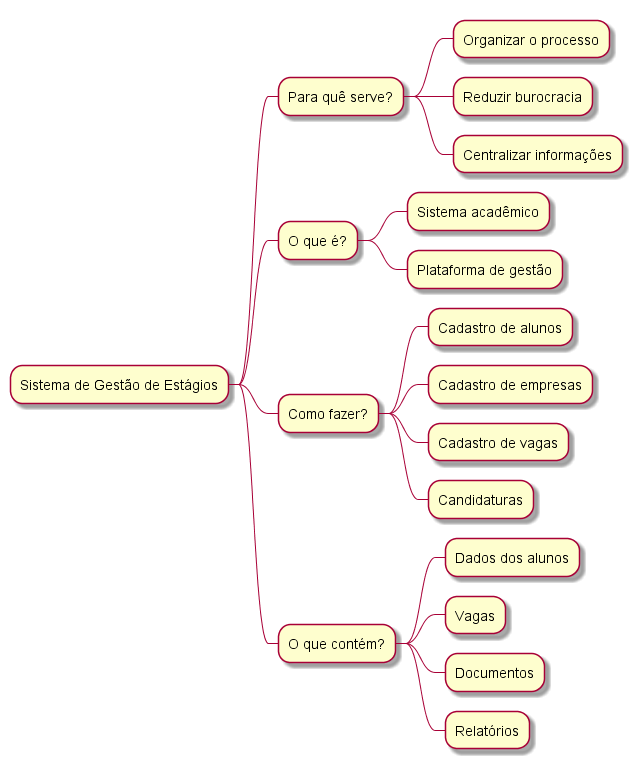

## Introdução

O mapa mental é uma técnica utilizada para organizar ideias de forma visual, facilitando a compreensão e a relação entre os principais elementos de um tema. Ele permite representar de forma estruturada conceitos importantes, auxiliando no entendimento geral do projeto.

---

## Metodologia

Com base no brainstorm realizado pela equipe para o desenvolvimento do Sistema de Gestão de Estágios, foi elaborado um mapa mental com o objetivo de sintetizar e organizar os principais pontos discutidos. Foram considerados aspectos como objetivos do sistema, sua definição, forma de implementação e informações gerenciadas pela aplicação.

---

## Mapa mental - Geral

### Versão 1.0

#### Mapa mental

---

## Conclusão

O mapa mental contribui para uma visão geral do Sistema de Gestão de Estágios, permitindo identificar de forma clara seus objetivos, funcionamento e principais componentes. Dessa forma, ele serve como um recurso visual que facilita a compreensão do problema e da solução proposta, auxiliando no desenvolvimento do sistema.

---

## Referências

> BRASIL. Lei nº 11.788, de 25 de setembro de 2008. Dispõe sobre o estágio de estudantes.

> BARBOSA, S. D. J.; DA SILVA, B. S. Interação humano-computador. Elsevier, 2010.

---

## Versionamento

| Data | Versão | Descrição | Autor(es) |
|------|--------|-----------|----------|
| 31/03/2026 | 1.0 | Criação do mapa mental | Jorge, Gabriel, Rafael, Davi e Biel |